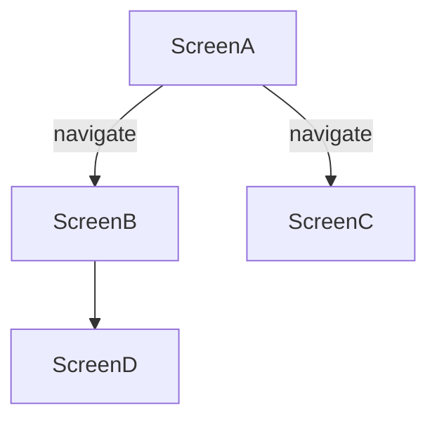

# Documentation Review and Enhancement Plan

## Current Documentation Status

### Strengths
- Good coverage of core screens (Home, Login, Events)
- Basic component documentation exists
- Navigation structure is partially documented
- Some API and state management documentation started

### Gaps to Address
1. **Screen Documentation**
   - Missing detailed UI breakdowns
   - Incomplete data flow documentation
   - Limited component hierarchy information

2. **Component Documentation**
   - Inconsistent detail level
   - Missing prop interfaces and usage examples
   - Limited state management documentation

3. **Navigation**
   - Incomplete navigation graph
   - Missing deep linking documentation
   - Limited route parameter documentation

4. **State Management**
   - Needs more detailed store structure
   - Action/reducer documentation incomplete
   - Missing persistence strategy details

5. **API Layer**
   - Incomplete endpoint documentation
   - Missing request/response schemas
   - Limited error handling documentation

## Enhancement Plan

### 1. Screen Documentation Template Update
Create a standardized template for screen documentation:

```markdown
# [Screen Name]

## Overview
- **File Path**: [path/to/screen]
- **Purpose**: [Brief description]
- **Related Screens**: [List of connected screens]

## UI Breakdown
### Visual Hierarchy
- [Main container]
  - [Header]
  - [Content sections]
  - [Footer/Action buttons]

### Interactive Elements
| Element | Type | Position | Action | State Changes | Handler |
|---------|------|----------|--------|---------------|---------|
| [Name] | [Button/Input/etc] | [Location] | [What it does] | [State changes] | [Handler function] |

## Data Flow
### Data Sources
- API Endpoints:
  - `GET /api/endpoint` - [Purpose]
  - `POST /api/endpoint` - [Purpose]
- Local State:
  - [State variable] - [Purpose]

### Props
```typescript
interface Props {
  // Prop definitions
}
```

### State Management
- [State variable] - [Purpose]
- [Effects and side effects]

## Component Tree
```
[ParentComponent]
├── [ChildComponent1]
│   └── [GrandchildComponent]
└── [ChildComponent2]
```

## Error States
- [Error condition] - [How it's handled]

## Technical Notes
- [Any implementation details, edge cases, or technical debt]
```

### 2. Component Documentation Template
```markdown
# [Component Name]

## Overview
- **File Path**: [path/to/component]
- **Purpose**: [Brief description]
- **Usage Locations**: [Where this component is used]

## Props Interface
```typescript
interface Props {
  // Required props
  requiredProp: string;
  
  // Optional props
  optionalProp?: number;
  
  // Event handlers
  onEvent: (data: any) => void;
}
```

## State Management
- **Local State**:
  - [State variable] - [Purpose]
- **Global State**:
  - [State slice] - [Purpose]

## Styling
- [Styling approach: StyleSheet, Styled Components, etc.]
- [Theme variables used]
- [Responsive behavior]

## Variants
| Variant | Description |
|---------|-------------|
| [variant] | [Description] |

## Accessibility
- [Accessibility features]
- [ARIA attributes]
- [Keyboard navigation]

## Examples
```tsx
<Component
  requiredProp="example"
  onEvent={handleEvent}
/>
```
```

### 3. Navigation Documentation
```markdown
# Navigation Guide

## Navigation Structure


## Route Parameters
| Screen | Parameter | Type | Required | Description |
|--------|-----------|------|----------|-------------|
| [Screen] | [param] | [type] | [Y/N] | [Description] |

## Deep Linking
| URL Pattern | Target Screen | Parameters |
|-------------|---------------|------------|
| `app://path` | [Screen] | [Params] |

## Navigation Actions
```typescript
// Example navigation action
const navigateToScreen = (id: string) => {
  navigation.navigate('Screen', { id });
};
```
```

### 4. State Management Documentation
```markdown
# State Management

## Store Structure
```typescript
interface AppState {
  // State slices
  auth: AuthState;
  events: EventsState;
  // ...
}
```

## Actions
### Auth Actions
| Action | Payload | Description |
|--------|---------|-------------|
| login | { email, password } | Initiate login |
| loginSuccess | { user } | Handle login success |

## Reducers
### Auth Reducer
```typescript
function authReducer(state, action) {
  switch (action.type) {
    case 'LOGIN':
      return { ...state, loading: true };
    // ...
  }
}
```

## Selectors
```typescript
const selectUser = (state: AppState) => state.auth.user;
```

## Persistence
- [Persistence strategy]
- [Data rehydration]
- [Sensitive data handling]
```

### 5. API Documentation
```markdown
# API Integration

## Base URL
`https://api.example.com/v1`

## Authentication
[Authentication method and requirements]

## Endpoints
### Users
#### GET /users
**Description**: Get list of users

**Query Parameters**:
| Name | Type | Required | Description |
|------|------|----------|-------------|
| limit | number | No | Number of users to return |
| offset | number | No | Pagination offset |

**Response**:
```typescript
interface UsersResponse {
  data: User[];
  total: number;
  limit: number;
  offset: number;
}
```

## Error Handling
### Error Response Format
```typescript
{
  error: {
    code: string;
    message: string;
    details?: any;
  }
}
```

### Common Error Codes
| Code | HTTP Status | Description |
|------|-------------|-------------|
| 400 | Bad Request | Invalid request data |
| 401 | Unauthorized | Authentication required |
| 403 | Forbidden | Insufficient permissions |
| 404 | Not Found | Resource not found |
| 500 | Internal Server Error | Server error |
```

## Implementation Timeline

### Phase 1: Foundation (1-2 days)
- [ ] Create documentation templates
- [ ] Set up documentation structure
- [ ] Document core screens and components

### Phase 2: Core Documentation (3-5 days)
- [ ] Complete screen documentation
- [ ] Document shared components
- [ ] Create navigation documentation

### Phase 3: Advanced Topics (2-3 days)
- [ ] Document state management
- [ ] Complete API documentation
- [ ] Add diagrams and visual aids

### Phase 4: Review and Polish (1-2 days)
- [ ] Review for completeness
- [ ] Verify accuracy
- [ ] Format and organize content

## Tools and Resources
- [Mermaid.js](https://mermaid-js.github.io/) for diagrams
- [TypeDoc](https://typedoc.org/) for code documentation
- [Swagger/OpenAPI](https://swagger.io/) for API documentation

## Review Process
1. Self-review against requirements
2. Peer review by team members
3. Update based on feedback
4. Final review before submission
